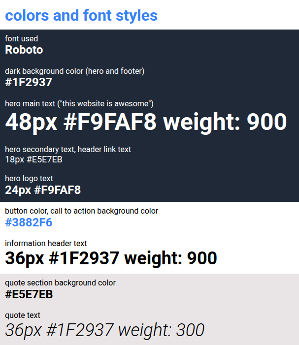

# The Odin project - HTML & CSS Project

Goal : create a landing page using the knowledge obtained during the foundation course - below are the 2 design images provided for the exercices.

## Expected Layout

## Fonts & Colors to use

